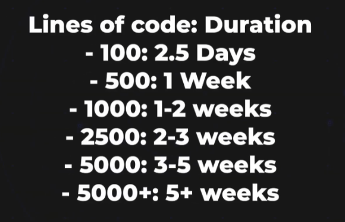
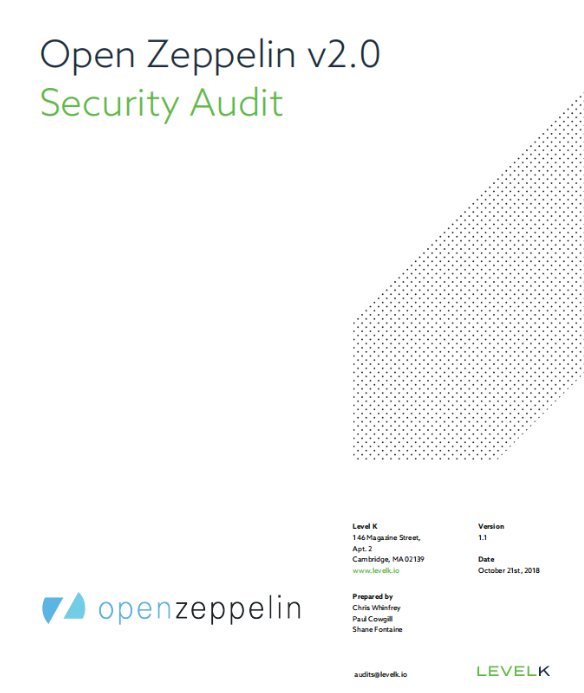
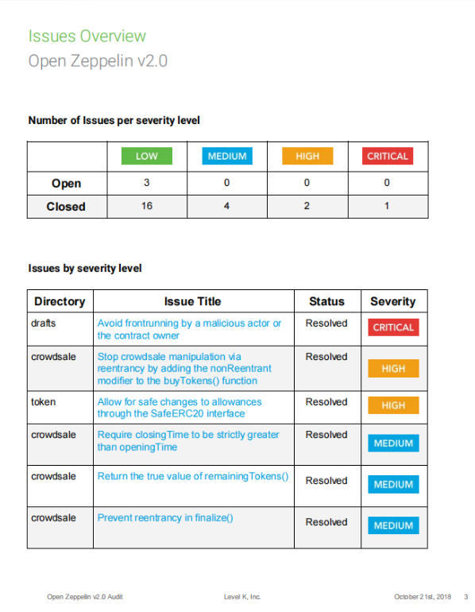

# Smart Contract Auditing Brief Introduction

**Author:** Peile Wu  
**Email:** peile.wu.1990@gmail.com  
**Date:** November 19, 2025

---

## Introduction

Smart contract auditing is a comprehensive security code review focused on identifying vulnerabilities in blockchain applications. Before deployment, protocols must address significant security risks in this permissionless adversarial environment.

**Critical Fact:** Once deployed, smart contracts cannot be modified. Auditing is your last line of defense.

For examples of failed smart contracts, visit [rekt.news](https://rekt.news/)

---

## Why Smart Contract Auditing Matters

### Deployment Risk

- Contracts deployed on-chain are **immutable**
- Blockchain is a **permissionless adversarial environment**
- Malicious users actively seek to exploit vulnerabilities
- Financial losses can be catastrophic and permanent

### Benefits Beyond Security

1. **Improved Code Quality** - Development team gains deeper understanding
2. **Faster Development** - Clear best practices speed up future iterations
3. **Advanced Tools Training** - Team learns industry-standard security tools
4. **User Confidence** - Demonstrates due diligence to users and investors

---

## Auditor's Goals

Professional security auditors focus on:

- **Finding as many vulnerabilities as possible** in the codebase
- **Providing security education** to the development team
- **Promoting coding best practices** for long-term protocol health
- **Clear documentation** of all discovered issues

---

## Audit Methodology

### Dual Approach

Auditors combine two complementary methods:

**Manual Code Review**

- Human expertise identifying complex logic flaws
- Understanding business logic and protocol design
- Detecting subtle edge cases and state management issues

**Automated Tools**

- Static analysis for common patterns
- Dynamic testing and formal verification
- Fuzzing and invariant testing
- Vulnerability scanning

---

## Audit Frequency

### Single Audit Is Not Enough

A comprehensive security program includes multiple audit types:

- **Standard Security Audits** - Full code review
- **Formal Verification** - Mathematical proof of correctness
- **Competitive Audits** - Multiple independent auditors
- **Bug Bounty Programs** - Community-driven discovery
- **Continuous Monitoring** - Post-deployment surveillance

---

## Major Audit Firms

### Industry Leaders

**Trail of Bits**


- Website: [trailofbits.com](https://www.trailofbits.com/)
- Careers: [trailofbits.com/careers](https://www.trailofbits.com/careers/)

**ConsenSys Diligence**


- Website: [consensys.io](https://consensys.io/)
- Open Roles: [consensys.io/open-roles](https://consensys.io/open-roles?discipline=32525)

**OpenZeppelin**


- Website: [openzeppelin.com](https://www.openzeppelin.com/)
- Careers: [openzeppelin.com/careers](https://www.openzeppelin.com/careers#positions)

**MixBytes**


- Website: [mixbytes.io](https://mixbytes.io/)
- Careers: [mixbytes.io/careers](https://mixbytes.io/careers)

**Other Notable Firms:**

- Sigma Prime
- Spearbit
- Trust Wallet

---

## Audit Pricing & Timeline

### Market Overview


Audit costs vary significantly based on:

- **Client reputation** and project scale
- **Auditor expertise** and firm reputation
- **Number of auditors** assigned
- **Code complexity** and scope
- **Market conditions** and demand

Typical audits range from $10,000 to $500,000+

---

## The Auditing Process

### Phase 1: Initial Discussion


**Ideal timing:** Initiate audit discussions **before code is complete**

#### Discussion Topics

1. **Code Complexity** - Architecture, number of contracts, dependencies
2. **Scope** - Which files and functions are in scope
3. **Duration** - Estimated timeline for review
4. **Timeline** - Schedule and important dates

#### Scope Estimation



Audit duration depends on:

- **Lines of code** - Total codebase size
- **Contract complexity** - State management, interactions
- **Business logic** - Intricate protocol mechanisms
- **Historical context** - Previous iterations and changes

### Phase 2: Commit Hash & Agreement

**Three Critical Elements:**

```
Commit Hash  →  Down Payment  →  Start Date
```

**Commit Hash**

- Unique identifier of your codebase at audit start
- Proves exact version being reviewed
- Ensures no code changes during audit

**Down Payment**

- Many firms require 30-50% upfront
- Secures your slot on audit schedule
- Remainder due upon completion

**Final Price**

- Determined after scope finalization
- Based on code complexity and timeline
- Firm commitment between parties

---

## During the Audit

### Auditor's Arsenal

Once audit begins, auditors deploy:

- Static analysis tools (Slither, Mythril)
- Dynamic testing frameworks
- Manual code inspection and logic review
- Formal verification tools
- Fuzzing and property-based testing

**Mission:** Find as many vulnerabilities as possible

### Keys to Audit Success

#### 1. Code Preparation

**Clear Documentation**

- Comprehensive README files
- Architecture diagrams
- Function specifications and intended behavior
- Edge cases and assumptions

**Readable Code**

- Well-commented functions and complex logic
- Clear variable and function naming
- Logical code organization
- Consistent formatting and style

**Robust Test Suite**

- Unit tests for individual functions
- Integration tests for protocol interactions
- Fuzz tests for edge cases
- Invariant tests for protocol guarantees

**Modern Best Practices**

- Follow latest Solidity conventions
- Use established patterns from OpenZeppelin
- Avoid deprecated features
- Gas optimization where appropriate

#### 2. Communication Strategy

**Dedicated Communication Channel**

- Slack, Discord, or email for questions
- Quick response to auditor inquiries
- Collaborative problem-solving

**Pre-Audit Code Walkthrough**

- Video presentation of architecture
- Explanation of key components
- Business logic walkthrough
- Development decisions and rationale

**Important Context**

- Developers understand codebase better than auditors
- Provide historical context and design decisions
- Explain why certain patterns were chosen

### Critical Insight

**80% of vulnerabilities are business logic bugs**, not simple coding errors.

Strong communication allows auditors to understand your protocol's intent and identify subtle logic flaws that automated tools miss.

### Team Efficiency

Modern test suites and tools enable auditors to:

- Spend less time understanding your development setup
- Focus more time discovering vulnerabilities
- Provide higher quality findings
- Make better recommendations

---

## Audit Reports

### Initial Report



Auditors deliver a comprehensive preliminary report containing:

- All discovered vulnerabilities
- Detailed vulnerability descriptions
- Proof-of-concept exploits and impact
- Recommended fixes and mitigations
- Code snippets highlighting issues

Example: [OpenZeppelin 2018 Audit Report](https://github.com/OpenZeppelin/openzeppelin-contracts/blob/master/audits/2018-10.pdf)

### Severity Classification



Issues classified by severity:

**Critical**

- Immediate exploitation possible
- Direct fund loss or protocol compromise
- Requires immediate fixing

**High**

- Serious vulnerabilities requiring urgent attention
- Significant risk to protocol or users
- Must fix before deployment

**Medium**

- Potential exploits with specific conditions
- Moderate impact on protocol
- Should fix in reasonable timeline

**Low**

- Minor issues or edge cases
- Limited impact in practice
- Good to fix but not urgent

**Non-Critical**

- Code quality improvements
- Gas optimization suggestions
- Documentation or clarity improvements

### Remediation Phase

**Development Team's Responsibilities:**

1. Review findings with audit firm
2. Implement fixes for identified issues
3. Re-test modified code thoroughly
4. Address auditor questions and concerns
5. Submit updated code for verification

**Timeline:** Fix implementation typically takes 25-50% of audit duration

### Final Report

After reviewing fixes, auditors issue a **Final Report** covering:

- Summary of initial findings by severity
- Description of fixes implemented
- Verification of remediation
- Remaining known limitations
- Overall security assessment

---

## Best Practices for Maximum Success

### Before Audit Starts

✅ Write comprehensive documentation  
✅ Develop robust test suite (include fuzz tests)  
✅ Add code comments and ensure readability  
✅ Follow modern Solidity best practices  
✅ Establish dedicated communication channel  
✅ Prepare pre-audit video walkthrough

### During Audit

✅ Respond promptly to auditor questions  
✅ Provide contextual information  
✅ Keep communication channel active  
✅ Share development history and decisions

### After Initial Report

✅ Prioritize critical and high-severity issues  
✅ Implement fixes thoroughly  
✅ Re-test all modified code  
✅ Collaborate with auditors on verification

---

## Important Caveats

### Audits Don't Guarantee Bug-Free Code

**Critical Understanding:**

An audit represents a **security journey**, not a guarantee:

- Audits find many but not all bugs
- Zero bugs is an unrealistic goal
- Security is an ongoing process
- Risk remains even after successful audit

### Multi-Layered Security Approach

Consider comprehensive security strategy:

- **Multiple Audits** - Different auditors find different issues
- **Bug Bounty Programs** - Community discovers edge cases
- **Insurance Coverage** - Protect against unknown risks
- **Post-Deployment Monitoring** - Continuous surveillance
- **Upgrade Mechanisms** - Ability to patch critical issues

---

## Conclusion

Smart contract auditing is an essential component of protocol development. By engaging professional auditors, following best practices, maintaining clear communication, and treating security as an ongoing commitment, development teams significantly reduce risks and build user confidence.

**Remember:** Security is not a one-time event but a continuous, evolving process.

---

## Resources

- [rekt.news](https://rekt.news/) - Smart Contract Failures Database
- [OpenZeppelin Audits](https://github.com/OpenZeppelin/openzeppelin-contracts/tree/master/audits)
- [Trail of Bits Security](https://www.trailofbits.com/)
- [Solidity Documentation](https://docs.soliditylang.org/)

---

**End of Document**
