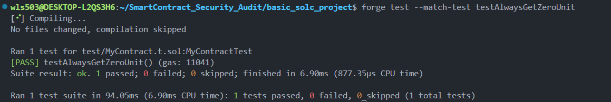
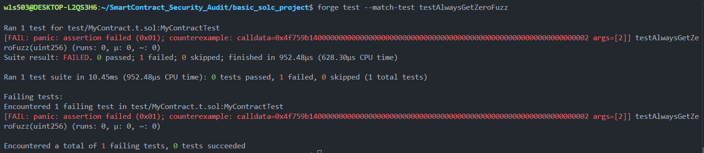
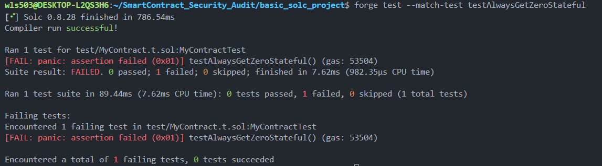
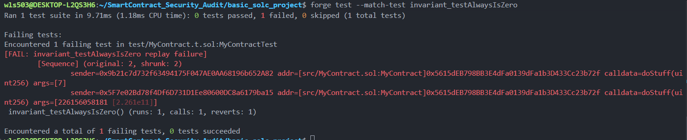

# Smart Contract Fuzz Testing Guide

**Author:** Peile Wu  
**Contact:** peile.wu.1990@gmail.com  
**Date:** November 14, 2025

---

## Table of Contents

1. [Introduction](#introduction)
2. [Core Concept: Invariants](#core-concept-invariants)
3. [Testing Methods](#testing-methods)
4. [Unit Testing](#unit-testing)
5. [Stateless Fuzz Testing](#stateless-fuzz-testing)
6. [Stateful Fuzz Testing](#stateful-fuzz-testing)
7. [Invariant Testing](#invariant-testing)
8. [Project Structure](#project-structure)

---

## Introduction

Fuzz testing is a software testing technique that feeds random or semi-random data to a program to find bugs and edge cases. In Solidity smart contracts, fuzz testing helps discover vulnerabilities that traditional unit tests might miss.

### The Problem We're Solving

Consider this contract:

```solidity
contract MyContract {
    uint256 public shouldAlwaysBeZero = 0;
    uint256 private hiddenValue = 0;

    function doStuff(uint256 data) public {
        if (data == 2) {
            shouldAlwaysBeZero = 1;  // BUG: Breaks the invariant!
        }
        if (hiddenValue == 7) {
            shouldAlwaysBeZero = 1;  // BUG: Breaks the invariant!
        }
        hiddenValue = data;
    }
}
```

This contract has **two hidden bugs** that traditional testing might not catch.

---

## Core Concept: Invariants

An **invariant** is a property of your system that should **always hold true**, regardless of inputs or execution sequence.

**Example Invariant:** "shouldAlwaysBeZero must always equal 0"

```
┌─────────────────────────────────────┐
│  Invariant: shouldAlwaysBeZero == 0 │
│                                     │
│  ✓ Should hold after every call     │
│  ✓ Should hold regardless of input  │
│  ✓ Should hold for any sequence     │
└─────────────────────────────────────┘
```

### Why Invariants Matter

- **Safety:** Defines the rules your contract must follow
- **Testing:** Provides clear pass/fail criteria
- **Bug Detection:** Finds edge cases humans might miss

---

## Testing Methods

There are **three main fuzz testing approaches**, each more powerful than the last:

```
┌──────────────────────────────────────────────────────────┐
│                    Testing Pyramid                       │
│                                                          │
│                  Invariant Testing ▲                    │
│                 (Most Powerful)    │                    │
│                                    │                    │
│              Stateful Fuzz Testing │                    │
│                                    │                    │
│            Stateless Fuzz Testing  │                    │
│                                    │                    │
│               Unit Testing ◄───────┴                    │
│            (Basic, Limited Scope)                       │
└──────────────────────────────────────────────────────────┘
```

---

## Unit Testing

**Purpose:** Test one specific scenario with fixed inputs

**Characteristics:**

- Fixed input value
- Single execution path
- Deterministic result
- Limited coverage

**Example:**

```solidity
function testAlwaysGetZeroUnit() public {
    uint256 data = 0;  // Fixed input
    exampleContract.doStuff(data);
    assert(exampleContract.shouldAlwaysBeZero() == 0);
}
```

**Result:** ✅ PASS (but only tested with data=0)

**Screenshot:**


**Problem:** This test passes, but it only checks one input. It misses the bug when `data == 2`!

---

## Stateless Fuzz Testing

**Purpose:** Test with many random inputs, each run independent

**Characteristics:**

- Random input generation (by Forge)
- Each test run is independent
- Fresh state before each call
- Tests many code paths automatically

**How It Works:**

```solidity
function testAlwaysGetZeroFuzz(uint256 data) public {
    // Forge randomly generates uint256 values for 'data'
    // Each call to this function uses a fresh contract state
    exampleContract.doStuff(data);
    assert(exampleContract.shouldAlwaysBeZero() == 0);
}
```

**Forge automatically runs this function hundreds of times with different `data` values:**

```
Run 1: data = 42      → doStuff(42) → state reset
Run 2: data = 0       → doStuff(0)  → state reset
Run 3: data = 2       → doStuff(2)  → ❌ FAILS! (shouldAlwaysBeZero becomes 1)
Run 4: data = 999     → doStuff(999) → ...
...
```

**Result:** ❌ FAIL

**Screenshot:**


**Why It Failed:** Forge found that when `data == 2`, the invariant breaks!

### Fixing the Bug

Once we find the bug, we comment out the problematic line:

```solidity
function doStuff(uint256 data) public {
    // Removed: if (data == 2) { shouldAlwaysBeZero = 1; }

    if (hiddenValue == 7) {
        shouldAlwaysBeZero = 1;
    }
    hiddenValue = data;
}
```

Now the stateless fuzz test passes! ✅

### Tuning Fuzz Runs

Edit `foundry.toml`:

```toml
[fuzz]
runs = 10000  # More runs = more random inputs tried
```

More runs increase the chance of catching edge case bugs.

---

## Stateful Fuzz Testing

**Purpose:** Test with multiple sequential calls where state persists

**Characteristics:**

- Multiple sequential function calls
- State persists between calls
- Second call can be affected by first call
- Finds bugs requiring specific execution sequences

**The Problem We're Solving:**

Even after fixing the `data == 2` bug, there's still a second bug:

```solidity
if (hiddenValue == 7) {
    shouldAlwaysBeZero = 1;  // This still breaks the invariant!
}
hiddenValue = data;  // hiddenValue can be set to 7
```

**The Bug Sequence:**

1. Call `doStuff(7)` → hiddenValue becomes 7
2. Call `doStuff(0)` → hiddenValue == 7 condition triggers → shouldAlwaysBeZero becomes 1 ❌

A single stateless fuzz test won't catch this because:

- First call: state is fresh, hiddenValue = 0
- Then state resets for the next call

But a **stateful** test keeps state between calls!

**Example:**

```solidity
function testAlwaysGetZeroStateful() public {
    // First call: set hiddenValue = 7
    uint256 data = 7;
    exampleContract.doStuff(data);
    assert(exampleContract.shouldAlwaysBeZero() == 0);

    // Second call: hiddenValue is still 7!
    // This triggers: if (hiddenValue == 7) → shouldAlwaysBeZero = 1
    data = 0;
    exampleContract.doStuff(data);
    assert(exampleContract.shouldAlwaysBeZero() == 0);  // ❌ FAILS!
}
```

**Result:** ❌ FAIL

**Screenshot:**


**Key Difference from Stateless:**

```
Stateless Fuzz:
├─ Call 1 (data=7) → [State Reset]
└─ Call 2 (data=0) → [Fresh State] ✅ Always passes

Stateful Fuzz:
├─ Call 1 (data=7) → [State Persists]
└─ Call 2 (data=0) → [Uses Previous State] ❌ Fails!
```

---

## Invariant Testing

**Purpose:** Most powerful approach - Forge automatically generates random call sequences

**Characteristics:**

- Forge automatically calls contract functions
- Random sequences of random inputs
- Invariant checked after every call
- Finds complex multi-step bugs

### Setup

First, import the invariant testing library:

```solidity
import {StdInvariant} from "forge-std/StdInvariant.sol";

contract MyContractTest is StdInvariant, Test {
    MyContract exampleContract;

    function setUp() public {
        exampleContract = new MyContract();
        // Tell Forge to run random functions on this contract
        targetContract(address(exampleContract));
    }

    // Define the invariant
    function invariant_testAlwaysIsZero() public {
        assert(exampleContract.shouldAlwaysBeZero() == 0);
    }
}
```

### How It Works

Forge automatically:

1. Generates random sequences of function calls
2. Tries random input values for each call
3. Checks the invariant after every call
4. Reports ANY sequence that breaks the invariant

```
Forge's Automatic Testing:
├─ Random Call Sequence 1:
│  ├─ doStuff(42)      → Check Invariant ✓
│  ├─ doStuff(99)      → Check Invariant ✓
│  └─ doStuff(7)       → Check Invariant ✓
│
├─ Random Call Sequence 2:
│  ├─ doStuff(7)       → Check Invariant ✓
│  └─ doStuff(0)       → Check Invariant ✗ [FOUND BUG!]
│
└─ ...
```

**Result:** ❌ FAIL (Sequence found: [7, 0])

**Screenshot:**


### Output Interpretation

When invariant testing finds a bug:

```
[Sequence] (original: 2, shrunk: 2)
├─ sender=0x9b2... calldata=0xdoStuff(7)
└─ sender=0x5f7... calldata=0xdoStuff(0)
```

- **original: 2** - Forge found a sequence of 2 calls
- **shrunk: 2** - Forge minimized it (couldn't make it shorter)
- Shows the exact sequence that breaks the invariant

---

## Project Structure

```
basic_solc_project/
├── img/unit_fuzz_test/
│   ├── invariant_test.png           # Invariant testing results
│   ├── stateful_fuzz_test.png       # Stateful fuzz testing results
│   ├── stateless_fuzz_test.png      # Stateless fuzz testing results
│   └── unitTest_passed.png          # Unit test results
│
├── script/
│   └── MyContract.s.sol            # Deployment script
│
├── src/
│   └── MyContract.sol              # Main contract (with bugs)
│
├── test/
│   └── MyContract.t.sol            # Test file (all test methods)
│
├── foundry.toml                    # Foundry configuration
└── README.md
```

### Key Files

**MyContract.sol** - The contract under test with intentional bugs
**MyContract.t.sol** - Contains all four test types
**MyContract.s.sol** - Deployment script

---

## Summary: Which Test Type to Use?

| Test Type          | When to Use           | Strength               | Limitation                  |
| ------------------ | --------------------- | ---------------------- | --------------------------- |
| **Unit**           | Quick smoke tests     | Simple, fast           | Limited coverage            |
| **Stateless Fuzz** | Find simple bugs      | Broad coverage         | Misses state-dependent bugs |
| **Stateful Fuzz**  | Manual sequences      | Targets specific flows | Manual work required        |
| **Invariant**      | Comprehensive testing | Automatic, thorough    | Can be slow                 |

**Recommendation:** Use all three! Unit tests for basic flow, stateless fuzz for quick bugs, and invariant tests for comprehensive coverage.

---

## Running the Tests

```bash
# Run all tests
forge test

# Run specific test type
forge test --match-test testAlwaysGetZeroUnit
forge test --match-test testAlwaysGetZeroFuzz
forge test --match-test testAlwaysGetZeroStateful
forge test --match-test invariant_testAlwaysIsZero

# Increase fuzz runs
forge test --fuzz-runs 10000
```

---

## Conclusion

Fuzz testing is essential for finding edge cases and hidden vulnerabilities in smart contracts:

1. **Start** with unit tests for basic functionality
2. **Add** stateless fuzz tests to find simple bugs
3. **Use** stateful fuzz tests for complex scenarios
4. **Deploy** invariant tests as your safety net

The combination of these three approaches provides comprehensive contract security.

---

**Reference:** This guide is based on Foundry's fuzz testing framework and follows industry best practices for smart contract security testing.
